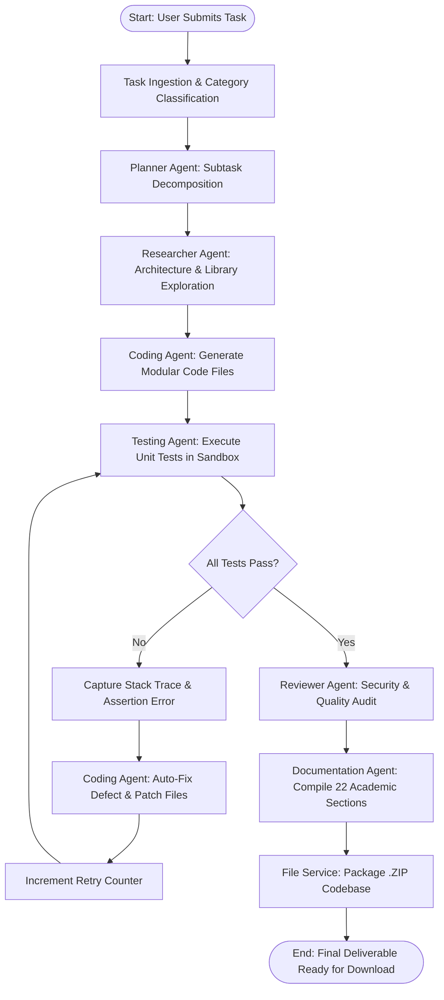

# Star UML: Activity Diagram

```mermaid
flowchart TD
    Start([Start: User Submits Task]) --> Ingest[Task Ingestion & Category Classification]
    Ingest --> Plan[Planner Agent: Subtask Decomposition]
    Plan --> Research[Researcher Agent: Architecture & Library Exploration]
    Research --> CodeGen[Coding Agent: Generate Modular Code Files]
    CodeGen --> RunTests[Testing Agent: Execute Unit Tests in Sandbox]
    
    RunTests --> Decision{All Tests Pass?}
    Decision -- No --> ErrorCheck[Capture Stack Trace & Assertion Error]
    ErrorCheck --> AutoFix[Coding Agent: Auto-Fix Defect & Patch Files]
    AutoFix --> RetestNotice[Increment Retry Counter]
    RetestNotice --> RunTests
    
    Decision -- Yes --> SecurityAudit[Reviewer Agent: Security & Quality Audit]
    SecurityAudit --> GenerateDocs[Documentation Agent: Compile 22 Academic Sections]
    GenerateDocs --> PackageZip[File Service: Package .ZIP Codebase]
    PackageZip --> Finish([End: Final Deliverable Ready for Download])
```
