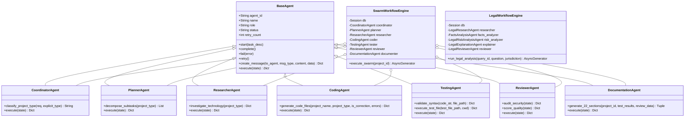

# Star UML: Class Diagram

```mermaid
classDiagram
    class BaseAgent {
        +String agent_id
        +String name
        +String role
        +String status
        +int retry_count
        +start(task_desc)
        +complete()
        +fail(error)
        +retry()
        +create_message(to_agent, msg_type, content, data) Dict
        +execute(state)* Dict
    }

    class CoordinatorAgent {
        +classify_project_type(req, explicit_type) String
        +execute(state) Dict
    }

    class PlannerAgent {
        +decompose_subtasks(project_type) List
        +execute(state) Dict
    }

    class ResearcherAgent {
        +investigate_technology(project_type) Dict
        +execute(state) Dict
    }

    class CodingAgent {
        +generate_code_files(project_name, project_type, is_correction, errors) Dict
        +execute(state) Dict
    }

    class TestingAgent {
        +validate_syntax(code_str, file_path) Dict
        +execute_test_file(test_file_path, cwd) Dict
        +execute(state) Dict
    }

    class ReviewerAgent {
        +audit_security(state) Dict
        +score_quality(state) Dict
        +execute(state) Dict
    }

    class DocumentationAgent {
        +generate_22_sections(project_id, test_results, review_data) Tuple
        +execute(state) Dict
    }

    class SwarmWorkflowEngine {
        -Session db
        -CoordinatorAgent coordinator
        -PlannerAgent planner
        -ResearcherAgent researcher
        -CodingAgent coder
        -TestingAgent tester
        -ReviewerAgent reviewer
        -DocumentationAgent documenter
        +execute_swarm(project_id) AsyncGenerator
    }

    class LegalWorkflowEngine {
        -Session db
        -LegalResearchAgent researcher
        -FactsAnalysisAgent facts_analyzer
        -LegalRiskAnalysisAgent risk_analyzer
        -LegalExplanationAgent explainer
        -LegalReviewerAgent reviewer
        +run_legal_analysis(query_id, question, jurisdiction) AsyncGenerator
    }

    BaseAgent <|-- CoordinatorAgent
    BaseAgent <|-- PlannerAgent
    BaseAgent <|-- ResearcherAgent
    BaseAgent <|-- CodingAgent
    BaseAgent <|-- TestingAgent
    BaseAgent <|-- ReviewerAgent
    BaseAgent <|-- DocumentationAgent

    SwarmWorkflowEngine o-- CoordinatorAgent
    SwarmWorkflowEngine o-- PlannerAgent
    SwarmWorkflowEngine o-- ResearcherAgent
    SwarmWorkflowEngine o-- CodingAgent
    SwarmWorkflowEngine o-- TestingAgent
    SwarmWorkflowEngine o-- ReviewerAgent
    SwarmWorkflowEngine o-- DocumentationAgent
```
