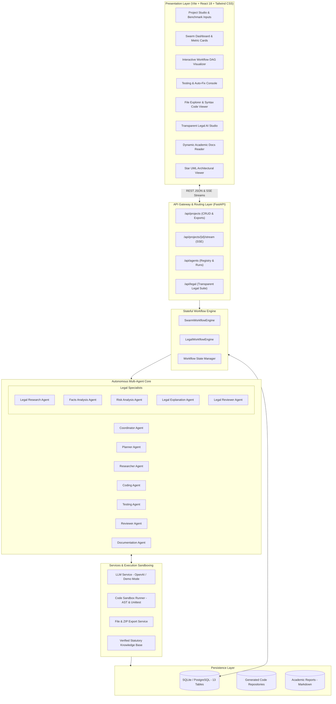

# Star UML: Component Diagram

```mermaid
graph TD
    subgraph Frontend_Layer ["Presentation Layer (Vite + React 18 + Tailwind CSS)"]
        UI_Input[Project Studio & Benchmark Inputs]
        UI_Dash[Swarm Dashboard & Metric Cards]
        UI_Graph[Interactive Workflow DAG Visualizer]
        UI_Test[Testing & Auto-Fix Console]
        UI_Code[File Explorer & Syntax Code Viewer]
        UI_Legal[Transparent Legal AI Studio]
        UI_Docs[Dynamic Academic Docs Reader]
        UI_UML[Star UML Architectural Viewer]
    end

    subgraph Backend_Gateway ["API Gateway & Routing Layer (FastAPI)"]
        ProjectsAPI["/api/projects (CRUD & Exports)"]
        StreamAPI["/api/projects/{id}/stream (SSE)"]
        AgentsAPI["/api/agents (Registry & Runs)"]
        LegalAPI["/api/legal (Transparent Legal Suite)"]
    end

    subgraph Orchestration_Engine ["Stateful Workflow Engine"]
        Engine[SwarmWorkflowEngine]
        LegalEngine[LegalWorkflowEngine]
        StateStore[Workflow State Manager]
    end

    subgraph Autonomous_Swarm ["Autonomous Multi-Agent Core"]
        Coordinator[Coordinator Agent]
        Planner[Planner Agent]
        Researcher[Researcher Agent]
        Coder[Coding Agent]
        Tester[Testing Agent]
        Reviewer[Reviewer Agent]
        Documenter[Documentation Agent]
        
        subgraph Legal_Specialists ["Legal Specialists"]
            LegalResearcher[Legal Research Agent]
            FactsAnalyzer[Facts Analysis Agent]
            RiskAnalyzer[Risk Analysis Agent]
            LegalExplainer[Legal Explanation Agent]
            LegalReviewer[Legal Reviewer Agent]
        end
    end

    subgraph Services_Layer ["Services & Execution Sandboxing"]
        LLM[LLM Service - OpenAI / Demo Mode]
        Sandbox[Code Sandbox Runner - AST & Unittest]
        FileService[File & ZIP Export Service]
        LegalDB[Verified Statutory Knowledge Base]
    end

    subgraph Persistence ["Persistence Layer"]
        DB[(SQLite / PostgreSQL - 13 Tables)]
        Disk[(Generated Code Repositories)]
        DocFiles[(Academic Reports - Markdown)]
    end

    Frontend_Layer <-->|REST JSON & SSE Streams| Backend_Gateway
    Backend_Gateway --> Orchestration_Engine
    Orchestration_Engine --> Autonomous_Swarm
    Autonomous_Swarm <--> Services_Layer
    Services_Layer --> Persistence
    Orchestration_Engine <--> DB
```
