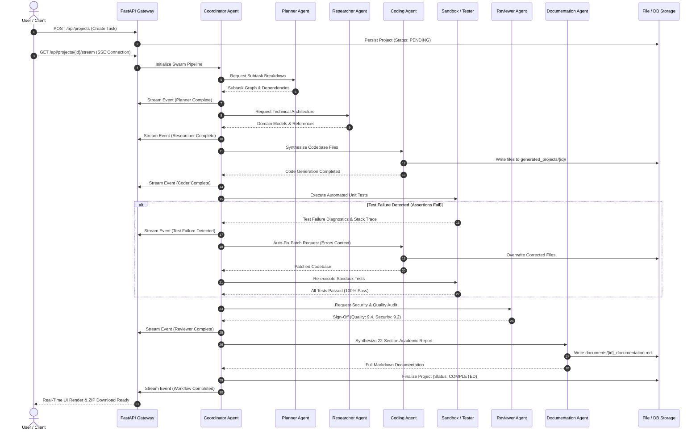

# Star UML: Sequence Diagram

```mermaid
sequenceDiagram
    autonumber
    actor User as User / Client
    participant API as FastAPI Gateway
    participant Coordinator as Coordinator Agent
    participant Planner as Planner Agent
    participant Researcher as Researcher Agent
    participant Coder as Coding Agent
    participant Sandbox as Sandbox / Tester
    participant Reviewer as Reviewer Agent
    participant Documenter as Documentation Agent
    participant Storage as File / DB Storage

    User->>API: POST /api/projects (Create Task)
    API->>Storage: Persist Project (Status: PENDING)
    User->>API: GET /api/projects/{id}/stream (SSE Connection)
    API->>Coordinator: Initialize Swarm Pipeline
    
    Coordinator->>Planner: Request Subtask Breakdown
    Planner-->>Coordinator: Subtask Graph & Dependencies
    Coordinator->>API: Stream Event (Planner Complete)

    Coordinator->>Researcher: Request Technical Architecture
    Researcher-->>Coordinator: Domain Models & References
    Coordinator->>API: Stream Event (Researcher Complete)

    Coordinator->>Coder: Synthesize Codebase Files
    Coder->>Storage: Write files to generated_projects/{id}/
    Coder-->>Coordinator: Code Generation Completed
    Coordinator->>API: Stream Event (Coder Complete)

    Coordinator->>Sandbox: Execute Automated Unit Tests
    alt Test Failure Detected (Assertions Fail)
        Sandbox-->>Coordinator: Test Failure Diagnostics & Stack Trace
        Coordinator->>API: Stream Event (Test Failure Detected)
        Coordinator->>Coder: Auto-Fix Patch Request (Errors Context)
        Coder->>Storage: Overwrite Corrected Files
        Coder-->>Coordinator: Patched Codebase
        Coordinator->>Sandbox: Re-execute Sandbox Tests
        Sandbox-->>Coordinator: All Tests Passed (100% Pass)
    end

    Coordinator->>Reviewer: Request Security & Quality Audit
    Reviewer-->>Coordinator: Sign-Off (Quality: 9.4, Security: 9.2)
    Coordinator->>API: Stream Event (Reviewer Complete)

    Coordinator->>Documenter: Synthesize 22-Section Academic Report
    Documenter->>Storage: Write documents/{id}_documentation.md
    Documenter-->>Coordinator: Full Markdown Documentation
    Coordinator->>Storage: Finalize Project (Status: COMPLETED)
    Coordinator->>API: Stream Event (Workflow Completed)
    API-->>User: Real-Time UI Render & ZIP Download Ready
```
